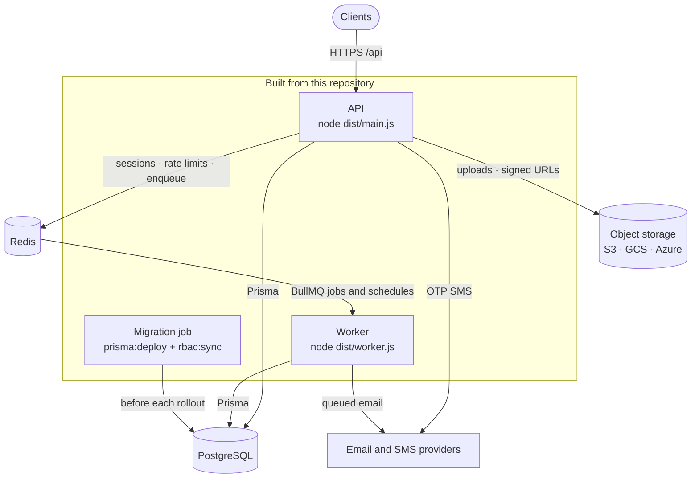

<div align="center">

# nestjs-api

## Production decisions included.

A NestJS API template for systems that will run in production —<br>
authentication, authorization, tenancy, background work and operations already decided.

[](https://github.com/jaylordibe/nestjs-api/actions/workflows/test.yml)
[](https://github.com/jaylordibe/nestjs-api/actions/workflows/security.yml)
[](package.json)
[](.nvmrc)
[](tsconfig.json)
[](LICENSE)

**[Why](#why-nestjs-api)** · **[Guardrails](#enforced-not-just-documented)** ·
**[Architecture](#architecture)** · **[What's&nbsp;included](#whats-included)** ·
**[Quick&nbsp;start](#quick-start)** · **[Docs](#documentation)**

</div>

---

## Why nestjs-api

Most NestJS starters help you start an application. This one is for starting a
production system.

`nest new` gives you a process that answers HTTP. It leaves open everything
that decides whether that process is safe to run: how a session ends and what
happens when a stolen refresh token is replayed, whose rows a query may return,
what holds when two requests race for the last owner seat, where recurring work
runs when there are four replicas, which configuration is too dangerous to boot
with, and how a deploy is ordered.

nestjs-api answers those questions up front, keeps the reasoning next to the
code, and — where a machine can check an answer — has a machine check it. The
stack itself (NestJS, Prisma, PostgreSQL, Redis, BullMQ) is the easy part; the
value is in the decisions around it.

**A good fit for**

- SaaS and multi-tenant products, where one tenant must never read another's data
- APIs with real authorization requirements — staff roles, tenant roles, support access
- Systems with background work: email, retention sweeps, scheduled jobs
- Teams that want one reviewed baseline for every new service

**Probably more than you need for**

- Prototypes and throwaway demos
- Small single-purpose services, or CRUD APIs with no tenancy and one kind of user
- Anything plain `nest new` already covers — this template has real moving parts to own

## Enforced, not just documented

A rule that lives only in a README is a rule nothing fails on. Where a
production assumption can be checked mechanically, this repository checks it,
as early in the pipeline as it can be caught.

```text
TypeScript  →  ESLint  →  config validation  →  boot-time checks  →  e2e tests  →  CI security gates
 (compile)     (lint)         (startup)            (startup)        (real infra)      (every PR)
```

| Layer | What it refuses | Examples from this repository |
|---|---|---|
| **Compiler** | Code that assumes data exists, or an override that silently stops overriding | `strict`, `noUncheckedIndexedAccess`, `noImplicitOverride` — [`tsconfig.json`](tsconfig.json) |
| **Lint** | Architectural shortcuts | `@casl/prisma` imported outside the authorization module; `src/common` importing `src/modules`; a raw `HttpException` instead of the `Errors.*` factory; a bare `user: true` include that skips soft-delete filtering — [`eslint.config.mjs`](eslint.config.mjs) |
| **Config validation** | Unsafe configuration, before a request is served | In production: a wildcard `CORS_ORIGIN`, an unset `TRUST_PROXY`, a stub email or SMS provider (stubs log one-time codes). Everywhere: a blank, short or template `JWT_SECRET`, and `REDIS_TLS_ENABLED` disagreeing with the `redis://` / `rediss://` scheme — [`env.validation.ts`](src/config/env.validation.ts) |
| **Boot checks** | An application whose wiring is inconsistent | A route handler with no authorization decision; a permission catalog that differs from the database; a role assigned outside its scope; a job with no handler, or a queue with no processor |
| **e2e tests** | Behaviour that breaks under real conditions | Run against real PostgreSQL, Redis and S3-compatible storage — no mocks. Concurrent refresh-token replay revokes the whole family; concurrent demotion never leaves a workspace with zero owners; an invitation redeemed twice at once yields one membership; tenant isolation holds under a forged path parameter |
| **CI** | Regressions and known-vulnerable artifacts | Lint, build, unit tests and four sharded e2e jobs; the RBAC catalog projected onto a fresh database and checked; the container image built and scanned with Trivy; a dependency audit gate and Trivy filesystem scan; a weekly authenticated OWASP ZAP API scan — [`.github/workflows/`](.github/workflows) |

Two details matter more than the list. The dependency audit fails on any high
or critical advisory **except** one with a documented, dated exception in
[`audit-gate.mjs`](.github/scripts/audit-gate.mjs), and it flags exceptions
that go stale. So an unfixable finding cannot force a choice between a
permanently red build and deleting the gate. And the authorization boot checks
fail closed on purpose: **an authorization hole should be a failed deploy, not
a 403 nobody notices.**

## Architecture



**Two runtimes, one codebase, one switch.** The API and the worker boot the
same `AppModule` from the same container image, and `QUEUE_WORKER_ENABLED`
decides which one consumes queues. The API serves HTTP and enqueues; it never
processes a job, so a slow mail provider never delays a response. The worker
consumes queues and owns the recurring schedules. Locally, one process does
both. Migrations and the RBAC projection run as a separate job **before** a new
revision takes traffic, never on startup.

**Every request takes the same path.** Global guards run in order — rate limit,
JWT, permissions — then a whitelisting `ValidationPipe`, the handler, a
serializer that honours `@Exclude()` on response DTOs, and one exception filter
that maps database errors and never leaks an internal message in a 5xx. Tenant
isolation is not a guard: a guard runs before the row is loaded, so reads are
scoped **in the query** through `AbilityScopedQueryService`. A caller who
cannot read a record gets a 404; one who can read it but not act gets a 403.

**Roles are code.** Permissions and roles are defined once, in
[`permission-catalog.ts`](src/common/authorization/permission-catalog.ts). The
database is a projection of it (`yarn rbac:sync`) and no endpoint creates a
role, so granting authority is a reviewable diff rather than an API call. Four
platform roles separate governance (`PLATFORM_ADMIN`) from technical authority
(`PLATFORM_ENGINEER`) and from two tiers of support; four workspace roles run
from owner to member. Ordinary accounts hold no platform role at all. Clients
fetch `GET /users/me/permissions` and rebuild the same CASL ability the server
uses, so UI checks cannot drift from the backend.

**Cloud-provider neutral.** The application needs an HTTP runtime, PostgreSQL,
a Redis-compatible backend, object storage, environment-injected secrets,
stdout logging and HTTP health checks, and nothing vendor-specific. Storage has
four adapters (`stub`, `s3`, `gcs`, `azure`), each SDK loaded only when
selected, and **none accepts a long-lived cloud credential**. The
[deployment contract](docs/deployment/README.md) maps all of this onto AWS,
Google Cloud, Azure, Kubernetes, Compose or a single VM.

## What's included

### Identity and sessions

- Email-verified registration. Login is throttled per identifier + IP (5/min) with no account lockout, and an unknown email costs the same bcrypt work as a wrong password.
- Access JWTs (15 minutes by default) carry only `{ sub, jti }` and are bound to the service by `iss` / `aud`. A password change invalidates every outstanding token.
- **Refresh-token rotation with reuse detection** ([RFC 9700 §4.14.2](https://www.rfc-editor.org/rfc/rfc9700.html#section-4.14.2)). Re-presenting a consumed token revokes its whole family — including when the replay is concurrent rather than sequential, which is the case a serial test cannot reach.
- Per-device logout (Redis blocklist) and logout everywhere. Password reset uses a single-use, hashed, 60-minute link and ends every session.
- Passwords of 8–72 characters with a letter and a digit, hashed with bcrypt at cost 12.
- GDPR data export and erase (PII anonymised, account soft-deleted).

### Authorization and tenancy

- DB-backed RBAC with CASL over two scopes: **platform** (staff) and **workspace** (tenant).
- Every handler declares exactly one of `@Public()`, `@AuthenticatedOnly()` or `@RequirePermission()`, or the application refuses to boot.
- Slack-style tenancy: one account, many workspaces, exactly one role in each. Memberships have a lifecycle (`active ⇄ suspended → left`). A pending invite is a separate single-use, hashed invitation, never a placeholder member.
- Role assignment is rank-guarded, so nobody can grant a role above their own. Ownership transfer never leaves a workspace without an owner.
- An audit log of every privileged action, filterable and searchable for incident review.

### Data

- Prisma 7 over `@prisma/adapter-pg`. The connection pool (`DATABASE_POOL_MAX`) is explicit and sized against the database's connection limit.
- Every resource has audit columns (`createdBy` / `updatedBy` / `deletedBy`). Soft delete is applied by a Prisma client extension to top-level reads — a convenience, explicitly not a security boundary.
- Pagination is bounded everywhere: `perPage` is clamped to 100, and there is no unpaginated "get all".
- Database errors are mapped once, centrally (`P2002` → 409, `P2003` → 400, `P2025` → 404), behind a stable `errorCode` contract that clients program against.

### Background work

- BullMQ is **the** mechanism for immediate, delayed and recurring work. It ships with retries and backoff, cancellation, rescheduling, bounded retention, and one logfmt line per lifecycle transition. A job's log lines carry the request id of the request that enqueued it.
- Queues, jobs and recurring schedules each have one registry. A job with no handler, or a queue with no processor, fails the boot. A schedule that Redis still holds but the code no longer declares is removed when the worker starts.
- Recurring work uses **BullMQ job schedulers stored in Redis**, not an in-process cron. A decorator-driven cron fires once per process, so a horizontally scaled API runs every sweep N times, and a restart during the scheduled minute skips it silently. A job scheduler produces exactly one job per tick, however many workers exist.

### Observability

- Structured pino logs (JSON in production) with `X-Request-Id` propagation, and redaction of credentials in headers and query strings.
- OpenTelemetry traces and metrics over vendor-neutral OTLP. Scrape them at the Collector; there is no `/metrics` endpoint.
- Health endpoints for liveness, readiness (database and queue), the worker heartbeat and the deployed version. Worker health is deliberately **off** readiness, so a restarting worker cannot pull the API out of rotation. A failing check logs the real cause and returns a fixed string, because driver errors quote internal hosts and users (CWE-209).

### Testing and quality

- e2e suites run in parallel against real PostgreSQL, Redis and S3-compatible storage. Each Jest worker gets its own database and Redis logical DB, on an isolated test stack that never touches development data.
- The suite asserts invariants rather than counts: tenant isolation, ownership, token families, races. The request edge it tests (helmet, CORS, prefix, proxy trust, Swagger gate) is the one production serves.
- TypeScript runs in strict mode, plus `noUncheckedIndexedAccess` and `noImplicitOverride`. ESLint, with Prettier, is the gate and never rewrites files.

### Deployment and operations

- Multi-stage Dockerfile: a non-root runtime under `tini` with npm stripped, plus a separate `migrate` target for the migration job.
- Swagger UI at `/api/docs`, generated from DTOs. It is always off in production and can be turned off elsewhere.
- A complete single-VM reference deployment (Docker Compose behind Cloudflare and Caddy), with deploy workflows for staging and production.
- [`docs/operations.md`](docs/operations.md) separates the operational controls that are enforced from those that are only scaffolded: backups, RPO/RTO, secret rotation, retention, incident response, rollback.

<details>
<summary><b>API surface</b>: every route, grouped by who may call it</summary>

All routes are under `/api`. Swagger at `/api/docs` is the full specification.

**Public**

- `POST /auth/register` — creates an unverified user and emails a verification link. Returns `{ message }` only. A registered email → 409 `UNIQUE_CONSTRAINT_VIOLATION`; a disposable domain → 400 `EMAIL_DOMAIN_DISALLOWED`.
- `POST /auth/login` / `POST /auth/refresh` — return `{ accessToken, refreshToken, expiresIn, user }`. Login rejects with `EMAIL_NOT_VERIFIED` if the email is unverified.
- `GET|POST /auth/verify-email` — consumes a verification link.
- `POST /auth/resend-verification` — resends the link (always 200, no enumeration).
- `POST /users/request-password-reset` — emails a reset link to `PASSWORD_RESET_URL?token=…&email=…` (always 200).
- `POST /users/reset-password` — `{ email, token, newPassword }`; single use, ends every session.
- `GET /app-versions` (paginated), `GET /app-versions/:id`, `GET /app-versions/latest?platform=mobile&os=ios` — client update checks. `os` names the **release train**: `mobile` and `desktop` ship one independently versioned build per OS, `web` ships one for everyone and omits it.
- `GET /enums` (all) and `GET /enums/{role-scopes,permission-ownerships,app-platforms,device-types,device-oses}` — client-facing enum catalog.
- `GET /public/ping` — example of the unauthenticated, throttled `public/` module pattern.

**Authenticated**

- `POST /auth/logout` / `POST /auth/logout-all` — per-token / everywhere revocation.
- `GET /users/me`, `GET /users/me/export` (GDPR data access), `PATCH /users/me`, `DELETE /users/me` (soft delete).
- `POST /users/me/gdpr-erase` — PII anonymisation and deletion (requires `currentPassword`).
- `PATCH /users/me/{username,email,password,profile-image}` — self-service updates. `email` and `password` end every other session and return a fresh `{ accessToken, refreshToken, expiresIn, user }`; a new email is unverified until its link is followed.
- `POST /users/me/request-phone-verification` → `PATCH /users/me/verify-phone` — OTP-verify a phone number; `PATCH /users/me/phone` sets one unverified.
- `GET /users/me/permissions` — the caller's packed CASL rules, for client-side ability sync.
- `POST|GET|PATCH|DELETE /device-tokens` — your own push tokens (a platform admin manages anyone's).

**Workspace scope**

- `POST|GET|PATCH|DELETE /workspaces` — any user may create one; the creator becomes its `WORKSPACE_OWNER`.
- `.../workspaces/:workspaceId/memberships` — the **one** roster. Every role is the same resource distinguished by `roleId`, so there is no parallel tree to keep in step. Rank-guarded: you may never grant a role above your own.
- `.../memberships/:id/{role,suspend,reactivate,transfer-ownership}` — each a separate permission, because CASL's `manage` wildcard would otherwise let anyone holding "update" also assign roles.
- `.../workspaces/:workspaceId/invitations` (create, list, `:invitationId/resend`, revoke) and `POST /invitations/accept` — invite an address that may not have an account yet. Single-use hashed token; concurrent redemption yields exactly one membership.

**Platform scope**

- `POST|GET|PATCH|DELETE /users`, `/users/:id`, `/users/:id/password` — full user management.
- `POST|DELETE /users/:userId/roles` — grant or revoke a platform role.
- `GET /roles`, `GET /roles/:id`, `GET /permissions` — **read-only**. Roles and permissions are both code-owned; no endpoint creates one.
- `GET /queues`, `GET|DELETE /queues/:queue/jobs/:jobId`, `POST /queues/:queue/jobs/:jobId/retry` — background-job diagnostics and recovery. Payloads are visible only to `PLATFORM_ENGINEER` (and `PLATFORM_ADMIN`); `PLATFORM_TECHNICAL_SUPPORT` can see that a job failed and retry it without reading the data it carried; app support has no queue access.
- `POST /users/:id/{revoke-sessions,resend-verification}` — narrow support capabilities, each its own permission, so app support can help an account holder without being able to change their email.
- `GET /audit-logs`, `GET /audit-logs/:id` — the platform audit trail. Filter by `action` / `actorId` / `targetUserId` / `startCreatedAt` / `endCreatedAt`, or cast a wide net with `?search=`, which matches the action name, either party's email and the `metadata` envelope as text (trigram-indexed). Rows arrive with `actor` / `targetUser` hydrated (id, email, name, current platform roles), batched one query per page, and still resolve for soft-deleted users.
- `POST|PATCH|DELETE /app-versions` — release signal management.

</details>

## Quick start

**Prerequisites:** Node 24 ([`.nvmrc`](.nvmrc)), Yarn 1.22, and Docker with Compose.

Create your own repository with **Use this template** on GitHub, or clone this one:

```bash
git clone https://github.com/jaylordibe/nestjs-api.git my-api && cd my-api
yarn install

# Environment: the defaults match docker-compose; only JWT_SECRET must be set
cp .env.example .env
sed -i.bak "s|^JWT_SECRET=.*|JWT_SECRET=\"$(openssl rand -hex 48)\"|" .env && rm .env.bak

# PostgreSQL, Redis and S3-compatible storage (RustFS) on host ports 5433 / 6378 / 9000
docker compose up -d

# Schema, then the RBAC catalog. The API refuses to boot until the catalog is in the database
yarn prisma:generate
yarn prisma:migrate
yarn prisma:seed        # projects the catalog and creates the SEED_* admin and user
                        # (`yarn rbac:sync` projects the catalog alone)

yarn start:dev
```

The Swagger UI is at [localhost:3000/api/docs](http://localhost:3000/api/docs)
and the readiness check is at [localhost:3000/api/health/readiness](http://localhost:3000/api/health/readiness).

Run the tests:

```bash
yarn test         # unit tests
yarn test:e2e     # e2e: starts its own isolated stack on 5434 / 6380 / 9002 (.env.test)
```

<details>
<summary><b>Day to day, after pulling, and troubleshooting</b></summary>

**Each workday.** Containers stop when your machine restarts:

```bash
docker compose up -d      # idempotent
yarn start:dev
```

`docker compose down` stops the containers and keeps the data;
`docker compose down -v` also deletes the volumes.

**After pulling changes:**

```bash
yarn install              # package.json changed
yarn prisma:generate      # prisma/schema.prisma changed
yarn prisma:migrate       # new migrations
yarn rbac:sync            # permission catalog changed
```

**Troubleshooting**

- **Port already in use (5433 / 6378 / 9000)**: something else is bound to it; `lsof -i :5433` finds it.
- **`JWT_SECRET` boot error**: `.env.example` leaves it blank, and validation requires at least 32 characters. Generate one with `openssl rand -hex 48`.
- **"Authorization catalog does not match the database"**: run `yarn rbac:sync`.
- **Prisma client out of date**: run `yarn prisma:generate` after schema changes.
- **Starting over**: run `docker compose down -v`, then `docker compose up -d`, `yarn prisma:migrate` and `yarn prisma:seed`. This deletes your local data.

</details>

### Commands

| Command | What it does |
|---|---|
| `yarn start:dev` | API and worker in one process, in watch mode |
| `yarn start:worker:dev` | The queue worker alone, in watch mode (needs `QUEUE_WORKER_ENABLED=true`) |
| `yarn build` | Compile and type-check into `dist/` |
| `yarn start:prod` / `yarn start:worker` | Run the compiled API / worker |
| `yarn lint` / `yarn lint:fix` | ESLint over `src`, `test`, `scripts` and `prisma`. `lint` is the gate and never rewrites files; `lint:fix` does |
| `yarn test` / `yarn test:cov` | Unit tests, optionally with coverage |
| `yarn test:e2e` | e2e tests against the isolated test stack, which it starts itself |
| `yarn stack:up` / `yarn stack:down` | Start / stop both the dev and the test stacks |
| `yarn prisma:generate` | Regenerate the Prisma client after schema edits |
| `yarn prisma:migrate` | Create and apply a migration in development (interactive) |
| `yarn prisma:deploy` | Apply pending migrations non-interactively, as a deploy does |
| `yarn prisma:seed` | Project the RBAC catalog and upsert the `SEED_*` admin and user |
| `yarn prisma:reset` | Drop, re-migrate and reseed the development database |
| `yarn prisma:studio` | Database browser |
| `yarn rbac:sync` / `yarn rbac:check` | Project the permission catalog into the database / exit 1 on drift |

## Building on it

**Adding a resource.** Every resource follows one pattern: five standard
endpoints (`POST /`, paginated `GET /`, `GET /:id`, `PATCH /:id`,
`DELETE /:id`), response DTOs rather than raw rows, audit fields, scoped
queries and an e2e spec. [`docs/resource-pattern.md`](docs/resource-pattern.md)
has the skeletons, and `Users`, `AppVersions` and `DeviceTokens` are working
examples.

**Adding background work.** Register the job, define its payload, write the
handler and enqueue it. [`src/common/queue/README.md`](src/common/queue/README.md)
covers jobs, recurring schedules, idempotency and new queues.

**Conventions.** [`AGENTS.md`](AGENTS.md) holds the repository's rules in
short form (naming, layering, errors, validation, tenant isolation,
configuration), and [`docs/engineering-conventions.md`](docs/engineering-conventions.md)
holds the reasoning behind each one.

<details>
<summary><b>Project layout</b></summary>

```text
src/
  telemetry.ts               # OpenTelemetry bootstrap, imported first by both entrypoints
  main.ts                    # HTTP entrypoint: configureHttpApp, shutdown hooks, listen
  configure-http-app.ts      # HTTP edge: helmet, /api prefix, CORS, trust proxy, gated Swagger
  worker.ts                  # second entrypoint: same AppModule, no HTTP server, consumes queues
  app.module.ts              # global modules + APP_PIPE/INTERCEPTOR/FILTER/GUARD registration
  config/                    # configuration.ts (typed factory), env.validation.ts (Joi)
  prisma/                    # @Global PrismaService + soft-delete extension
  common/
    authorization/           # permission catalog (single source of truth), subject keys, AppAbility
    decorators/              # RequirePermission, AuthenticatedOnly, Public, CurrentUser, CurrentAbility
    dto/                     # MetaQueryDto, PaginatedResponseDto<T>
    enums/                   # RoleScope, PermissionOwnership, SeededRoleName, Gender, AppPlatform, …
    filters/                 # GlobalExceptionFilter (single unified filter)
    errors/                  # AppException, ErrorCode catalog, Errors factory
    email/                   # EmailService, adapters (stub/resend), typed Handlebars templates
    sms/                     # SmsService, adapters (stub/twilio)
    storage/                 # FileStorageService, adapters (stub/s3/gcs/azure)
    logging/                 # pino-http options (redaction, request id)
    telemetry/               # telemetry shutdown hook
    constants/, pipes/       # shared constants, ParseJsonPipe
    audit/                   # AuditService (@Global)
    redis/                   # RedisService (@Global, shared ioredis client)
    queue/                   # @Global BullMQ layer: registries, producer, processor base, handlers
    util/                    # pure helpers (+ co-located *.util.spec.ts)
  modules/
    auth/                    # AuthService, AuthController, JwtStrategy, JwtAuthGuard
    authorization/           # @Global: AbilityFactory, grants cache, PermissionsGuard, boot-time gates
    users/                   # canonical resource — full CRUD + self-service + GDPR erase
    roles/                   # roles + permissions (both code-owned, read-only) + platform-role assignment
    workspaces/              # tenant resource + memberships (one roster, every role) + invitations
    queue-admin/             # operator queue diagnostics; payloads gated behind `readPayload`
    audit-logs/              # read-only audit trail
    app-versions/            # client update signal, one row per release train
    device-tokens/           # push notification tokens (FK to User, hard delete)
    health/                  # liveness + readiness + worker heartbeat + version
    enums/                   # public enum catalog for clients
    public/                  # example unauthenticated routes
prisma/
  schema.prisma              # models
  migrations/                # a single `init` migration (a starter is a fork in time)
  rbac-seeder.ts             # projects the permission catalog onto the DB (used by seed.ts and rbac:sync)
  seed.ts                    # rbac-seeder + env-driven admin/demo users
  scripts/                   # rbac:sync / rbac:check / ZAP token scripts
  seeds/                     # static seed data
scripts/                     # build-config contract spec
test/                        # e2e specs (real Postgres + Redis + S3, no mocks) + setup/
```

</details>

### Working with coding agents (optional)

[`AGENTS.md`](AGENTS.md) is the repository's truth for any coding agent:
canonical commands, high-risk paths, conventions and consumers. `CLAUDE.md`
imports it. Contributors on [Claude Code](https://code.claude.com) can add the
[Himoa](https://github.com/jaylordibe/himoa) plugin for a reviewed
requirement-to-diff workflow (`/plugin marketplace add jaylordibe/himoa`, then
`/plugin install himoa@jaylordibe`). `.claude/` commits this repository's own
permission rules and four domain playbooks, covering auth, authorization,
resources and the e2e harness. The only per-machine step is a one-time
issue-tracker login (`/mcp` → authenticate **atlassian**). None of this is
needed to build, run or test the API.

## Going to production

Start with the [deployment contract](docs/deployment/README.md): runtime
commands, container, database, Redis, storage, secrets, health and environment.
A deploy runs the migration job (`yarn prisma:deploy && yarn rbac:sync`) to
completion, then rolls out the API with `QUEUE_WORKER_ENABLED=false` and the
worker with `QUEUE_WORKER_ENABLED=true`.

<details>
<summary><b>Production checklist</b>: confirm these before the first real deploy</summary>

- [ ] `JWT_SECRET` regenerated per environment (`openssl rand -hex 48`). Validation refuses a blank, short or template value at boot.
- [ ] `CORS_ORIGIN` set to an explicit origin list (`*` is refused in `NODE_ENV=production`).
- [ ] `TRUST_PROXY` set to `"1"` or a CIDR list behind a load balancer (`"false"` and `"true"` are refused in production).
- [ ] `TRUST_CLOUDFLARE_HEADERS` left at `false` **unless** the origin is provably unreachable except through Cloudflare (see the `cloudflare_only` snippet in `docs/prod/Caddyfile`). These headers are forgeable by anyone who can reach the origin directly, and they are written into `audit_logs`, the table an incident responder trusts.
- [ ] `EMAIL_PROVIDER=resend` with `RESEND_API_KEY` and `EMAIL_FROM`, on a verified domain with DKIM/SPF/DMARC in DNS.
- [ ] `OTEL_EXPORTER_OTLP_ENDPOINT` pointed at an OpenTelemetry Collector (traces and metrics), with an error tracker wired behind it or into pino.
- [ ] Managed PostgreSQL point-in-time recovery (PITR) enabled.
- [ ] Secrets served from a secret manager (GCP Secret Manager / Vault / Kubernetes secrets) rather than a plaintext env file.
- [ ] `QUEUE_WORKER_ENABLED=false` on the API deployment and `true` on the worker deployment. The API must never process jobs, and only the worker installs recurring schedules.
- [ ] `DATABASE_POOL_MAX` × max instances (API **and** worker), plus the migration job, kept under the database's connection limit. The arithmetic is worked through in `.env.example`.
- [ ] `REDIS_TLS_ENABLED=true` with a `rediss://` URL against any managed Redis. Boot fails if the flag and the scheme disagree, so a half-configured TLS setup cannot ship silently.
- [ ] Storage bucket kept **private** (the default), with reads served through short-lived signed URLs and authorization performed before signing. Set `STORAGE_PUBLIC_URL_BASE` only if the bucket really is public or CDN-fronted.
- [ ] Migrations run as a separate job before the new revision takes traffic, never on API or worker startup.
- [ ] A retention job scheduled to hard-delete soft-deleted users after N days (this cascades to `device_tokens` via FK).
- [ ] Redis running with AOF persistence, a durable volume and backups. **Queued jobs are exactly as durable as the Redis they live in**, and there is no in-memory fallback by design.
- [ ] `GET /api/health/workers` monitored. It is off readiness on purpose, so nothing else will tell you the worker died.

</details>

## Documentation

| Document | For |
|---|---|
| [`AGENTS.md`](AGENTS.md) | Repository rules, canonical commands and high-risk paths |
| [Engineering conventions](docs/engineering-conventions.md) | The reasoning behind every rule |
| [Authorization contract](src/common/authorization/README.md) | RBAC, CASL, tenant isolation, roles, memberships and invitations |
| [Queue infrastructure](src/common/queue/README.md) | Jobs, schedules, retries, idempotency, running the worker |
| [Error contract](src/common/errors/README.md) | The error envelope and `ErrorCode` catalog |
| [Resource pattern](docs/resource-pattern.md) | Skeletons for a new CRUD resource |
| [Deployment contract](docs/deployment/README.md) | What the application needs from any platform |
| [Single-VM deployment](docs/README.md) | The Compose-based [production](docs/prod/README.md) and [staging](docs/staging/README.md) setups |
| [Operational readiness](docs/operations.md) | Which operational controls are enforced, and which are only scaffolded |

## Stack

| Concern | Choice |
|---|---|
| Runtime | Node 24 (`.nvmrc`, `.node-version`, `engines`, the Dockerfile and CI agree), Yarn 1.22 pinned via `packageManager` |
| Framework | NestJS 12 on Express, TypeScript in strict mode |
| Data | PostgreSQL 18, Prisma 7 via `@prisma/adapter-pg` |
| Cache, sessions, queues | Redis 8 (ioredis), BullMQ via `@nestjs/bullmq` |
| Auth | `@nestjs/jwt` + `passport-jwt`, bcrypt, CASL |
| Validation | class-validator + class-transformer for requests; Joi for configuration |
| Rate limiting | `@nestjs/throttler` with shared Redis storage |
| Observability | pino via `nestjs-pino`, OpenTelemetry SDK with OTLP exporters, `nestjs-cls` request context |
| Integrations | Resend (email), Twilio (SMS), S3 / GCS / Azure Blob, each behind an adapter with a `stub` for development |
| API docs | `@nestjs/swagger`, generated from DTOs by the compiler plugin |
| Testing | Jest + supertest; e2e against real infrastructure |

---

<div align="center">

**Production decisions included.**

MIT licensed. See [LICENSE](LICENSE).

</div>
